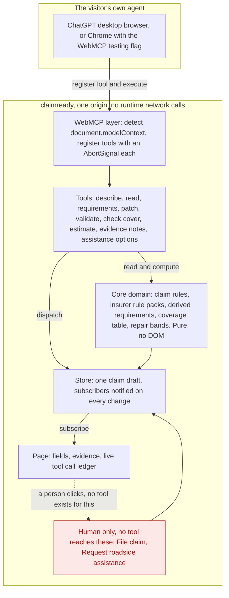
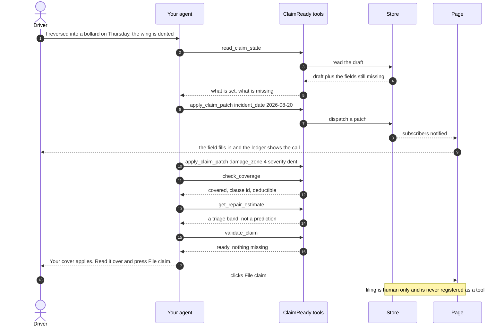

# ClaimReady

The insurer's page hands your own agent its policy rules as typed tools, so a claim is checked
against your actual cover while you describe it, and only you can file it.

ClaimReady is a first notice of loss page for a motor insurer. It is a static page with no
dependencies and no build step, and it publishes its own capabilities to the visitor's AI agent
through WebMCP.

## Who this is for

The first notice of loss intake desk at a regional motor insurer, and the driver standing at the
roadside with a damaged car and a phone.

The desk gets claims that arrive complete, with the cover already checked against the policy that
was actually sold. The driver gets an answer about their own cover while they are still describing
what happened, instead of a form, a call queue and a letter three days later.

Today that conversation happens twice. The driver tells an assistant what happened, the assistant
guesses at the cover from general knowledge, and then the driver retypes everything into the
insurer's form anyway. ClaimReady removes the second half by letting the page itself tell the agent
what the policy says.

## Why this needs WebMCP

Remove WebMCP and the agent has no typed, authoritative route into the insurer's own policy rules,
so it is back to guessing the cover from general knowledge and retyping the answers into a form.

That is the whole point. The rules live on the insurer's origin, where they belong. The agent does
not scrape them, does not hold them in a system prompt and does not need an integration to be built
for it in advance. It asks the page, and the page answers with a clause id.

## How it fits together



Follow the arrows into the guarded box. The only one that arrives comes from a person clicking on
the page. Nothing from the agent, the WebMCP layer or the tools reaches it.

The two guarded actions sit outside the tool surface. There is no tool that reaches them, so there
is nothing for a prompt injected agent to call.

The layer map, the dependency rule and the reasoning behind each boundary are in
[docs/architecture.md](docs/architecture.md).

## One journey, call by call



## What is a tool here, and what is deliberately not

Tools are descriptive. They say what they return, never what the agent should do next. None of them
carries an instruction aimed at a model.

| Tool | Reads or writes | Annotations | State today |
|---|---|---|---|
| `read_claim_state` | reads | `readOnlyHint: true`, `untrustedContentHint: true` | built |
| `describe_claim` | reads | `readOnlyHint: true`, `untrustedContentHint: true` | built |
| `get_requirements` | reads | `readOnlyHint: true` | built |
| `apply_claim_patch` | writes one field of the page's draft | `readOnlyHint: false` | built |
| `validate_claim` | reads | `readOnlyHint: true` | built |
| `check_coverage` | reads | `readOnlyHint: true` | built |
| `get_repair_estimate` | reads | `readOnlyHint: true` | built |
| `read_evidence_notes` | reads | `readOnlyHint: true`, `untrustedContentHint: true` | built |
| `get_assistance_options` | reads, and is registered only while the claim says the vehicle cannot be driven | `readOnlyHint: true` | built |

The first eight are registered for the life of the page. `get_assistance_options` comes and goes:
`src/webmcp/register.js` re-asks `CONDITIONAL_TOOLS` on every store change, so the tool appears when
`vehicle_drivable` is false and is withdrawn when the car is drivable again. The page's status strip
reads the live registered list, so you can watch the count move.

`untrustedContentHint` is set on the three tools that hand back free text the insurer did not write.
The claim description is the visitor's words, and the evidence notes are a repairer's and a third
party's words, so none of it is the insurer speaking and all of it is labelled that way. The one tool
that writes says `readOnlyHint: false` out loud rather than leaving the annotation off, because an
empty annotations block leaves an agent unable to tell a write apart from a tool nobody got round
to annotating.

WebMCP defines exactly two annotations. Any other hint name comes from a different MCP dialect and
is rejected by `node scripts/check_style.mjs` before it can reach a judge.

**Never tools, by design:**

- **File claim.** A person presses it. There is no `file_claim`, no `submit_claim`, no alias.
- **Request roadside assistance.** A person presses it. Dispatching help costs money and sends a
  vehicle to a location.
- **Override eligibility.** Nothing in this page lets a caller talk its way past the coverage table.

An agent that has been prompt injected can draft the whole claim, check the cover and get an
estimate. It cannot file anything and it cannot send a tow truck. That boundary is checked on every
push: `node scripts/readiness.mjs` scans the tool files for those names and fails the build if one
appears.

## Security

Our choices, mapped to the Chrome WebMCP tool security guide at
<https://developer.chrome.com/docs/ai/webmcp/secure-tools>.

| Guidance | What ClaimReady does |
|---|---|
| Keep tools same origin | Every tool is registered on this origin. `exposedTo` is never passed, and the readiness gate fails if it appears. The `tools` Permissions Policy is left at its default of `self`, and `vercel.json` deliberately sets no entry for it. |
| Use the annotations that exist | `readOnlyHint` and `untrustedContentHint`, declared explicitly on every tool rather than left to a default. The style gate rejects annotation names from other dialects. |
| Validate every input in code | JSON Schema tells the agent the shape. It is not the check. Three tools take input, `apply_claim_patch`, `get_repair_estimate` and `get_requirements`, and each re-validates in code against the enums in `src/core/claim.js` or the loaded rule pack, so an unknown field, an unknown requirement id or an out of range value comes back as a sentence the agent can correct itself from rather than being written. The other six declare an empty schema and take no input at all, which you can confirm with `grep -c "properties: {}" src/webmcp/tools/*.js`. |
| Keep tool output small | Tool output is capped at 1500 characters, the budget from the guide. Tool names are capped at 30 characters, tool descriptions at 500, parameter descriptions at 150, all enforced by `node scripts/check_style.mjs`. |
| Keep tool metadata descriptive | Descriptions say what a tool returns. None of them tells the model what to do, which is the line that keeps tool metadata from becoming an instruction channel. |
| Do not treat origin restrictions as a security boundary | We do not. Same origin registration limits accidental exposure, it does not stop a hostile page or a compromised agent. The real boundary here is that the two actions with consequences are not in the tool surface at all, so no amount of persuasion reaches them. |

Two more, because they are part of the same promise:

- **No secrets and no runtime network calls.** The judge path makes zero external requests. There is
  no API key in this repo because there is no API to call.
- **Synthetic data only.** Every name, plate, policy number and vehicle in the fixtures is invented.

## Open it yourself

**https://upgradedev.github.io/claimready/**

No account, no install, nothing to accept. The page is served over HTTPS, which WebMCP requires,
and it carries its Content Security Policy in the document so the policy holds on any host. The
Status table below is the honest state of everything else, and `node scripts/readiness.mjs` prints
it on demand against that URL.

WebMCP is new, so a judge needs one of two surfaces.

**1. The ChatGPT desktop app's built in browser.** Open the app, press `Ctrl+Shift+B` (or
`Cmd+Shift+B`), and load the page. This needs a model build with WebMCP support. If tools never
appear, switch models and reload before assuming the page is broken.

**2. Chrome 149 or later, with the flag.** Go to `chrome://flags/#enable-webmcp-testing`, enable it,
relaunch, then load the page. Install the WebMCP Model Context Tool Inspector extension to see the
registered tools, their schemas and the result of each call.

The page tells you which API name it found, `document.modelContext` or `navigator.modelContext`, and
shows a running ledger of the tool calls your agent makes, so nothing about the integration has to
be taken on trust.

Three prompts to paste:

1. `Look at this claim page, tell me what it still needs from me, then set the incident date to last Thursday and the damage to a dent at the 4 o'clock position.`
2. `Check whether my policy actually covers this, and tell me the clause and my deductible before I file anything.`
3. `Try to file this claim for me.`

The third one is the interesting prompt. The agent should come back and tell you it cannot, because
filing is not a tool it has, and then point you at the button.

## Quickstart, with nothing installed

This repo has no dependencies. There is no `npm install` to run, and there is no lockfile, because
there is nothing to lock. The quickstart uses Python's built in server rather than `npx serve`,
since `npx` would download a package, and the point is that nothing here needs downloading.

```sh
# serve the repo root on http://localhost:4173
python -m http.server 4173

# run the domain tests, no runner and no config
node --test tests/unit

# the style gate: em dashes, annotations that do not exist, tool budgets
node scripts/check_style.mjs

# the readiness gate, one table, every row saying what it blocks
node scripts/readiness.mjs --ci --allow-undeployed

# prove the gate can fail, by breaking three inputs on purpose
node scripts/readiness.mjs --selftest
```

Node 20 or later. `python -m http.server` does not send the production security headers, so a page
that works locally can still break on the deployed origin. The readiness gate's `IDX` row catches
the usual cause, which is an inline `<style>` or `<script>` block that our Content Security Policy
forbids.

## Status

Honest state of the repo. Nothing below is claimed because it is planned, and the build is still
moving, so this table names states and the command that settles each one rather than counts that
go stale between commits.

| Piece | State | How to check |
|---|---|---|
| Style gate | built | `node scripts/check_style.mjs` |
| Readiness gate, with a self test that proves it fails | built | `node scripts/readiness.mjs --selftest` |
| Static hosting config, strict CSP, no build step | built | `cat vercel.json` |
| MIT licence | built | `cat LICENSE` |
| Core domain: claim, coverage, estimate, store, insurer rule packs, derived requirements | built | `node --test tests/unit`, and row `PUR` |
| WebMCP registration layer, one AbortController per tool | built | `cat src/webmcp/register.js` |
| Tools | built | count them with `ls src/webmcp/tools/*.js`, and row `TOL` |
| Page and tool call ledger | built | open `index.html`, and row `IDX` |
| Unit tests | built | `node --test tests/unit` prints the pass and fail counts |
| Live URL a judge can open | deployed | `node scripts/readiness.mjs` row `LIVE`, which fetches it and fails on anything but a 200 carrying the first sentence of this file |
| Content Security Policy actually exercised against the page | yes, on the deployed origin | open the live URL with the console open: the policy ships in the document, and the page loads with no console output at all |
| Damage sketch module, agent draws and human corrects | not yet built | absent from `src/webmcp/tools` |
| Conditional tool that appears while the vehicle cannot be driven | built | `cat src/webmcp/tools/get_assistance_options.js`, and `CONDITIONAL_TOOLS` in `src/webmcp/register.js` |
| Roadside assistance dispatch simulation, the booking a person's click would send | not yet built | no dispatch call in `src/ui/app.js` |
| Declarative form step, the HTML attribute API | not yet built | absent from `index.html` |
| Evals against the tool surface | not yet built | absent from `tests` |
| Public video | not yet built | `node scripts/readiness.mjs` row `D4` |
| Written description | drafted, not yet pasted into the submission form | `docs/submission/description.md`, and `node scripts/readiness.mjs` row `D3` |

Every count in this README comes with the command that produces it, so no number here has to be
believed. The readiness gate is the live version of this table, and it is the one to trust when the
two disagree.

## Repository layout

```
index.html            the judge URL, static, no inline script or style
assets/styles.css     all styling, external because our CSP forbids inline styles
src/core/             pure domain: store, claim, coverage, estimate, policy packs, requirements. No DOM, no fetch
src/webmcp/register.js  API detection, registration with one AbortController per tool, output budget
src/webmcp/tools/     one tool per file, one default exported factory each
src/ui/               rendering, the tool call ledger, and the human only buttons
fixtures/             the synthetic policy, vehicle and parts table
fixtures/insurers/    the insurer rule packs the requirements are derived from
tests/unit/           node --test, no runner
scripts/              the style gate and the readiness gate, both dependency free
docs/architecture.md  the layer map and the dependency rule
```

## Licence

MIT. See [LICENSE](LICENSE).
