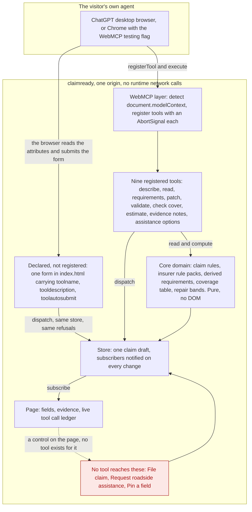
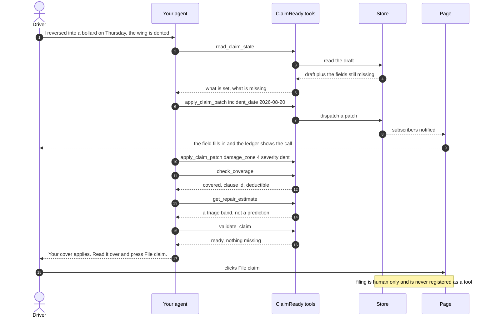

# ClaimReady

The insurer's page hands your own agent its rules as typed tools, so you learn what you
are covered for while still describing the crash.

[](https://github.com/upgradedev/claimready/actions/workflows/ci.yml)
[](https://github.com/upgradedev/claimready/actions/workflows/readiness.yml)
[](https://github.com/upgradedev/claimready/actions/workflows/evals.yml)
[](LICENSE)

Two of those badges answer two different questions and it is worth knowing which is which. **CI** is
the engineering: secret scan, style gate, unit tests. **Readiness** is the submission: one table of
deliverable rows, and it is red on purpose while the public video is missing. The readiness gate
refuses to let a mandatory deliverable pass in any mode, `--ci` included, and a badge that hid that
would be the wrong badge. Until 2026-08-28 the two were one workflow, so the engineering badge read
red on every branch for a missing video, which told a reader the build was broken when nothing about
the build was.

A badge for a workflow that has not yet run on the default branch reports nothing rather than
reporting a pass. If **Readiness** looks blank, that is what it is saying.

ClaimReady is a first notice of loss page for a motor insurer. It is a static page with no
dependencies and no build step, and it publishes its own capabilities to the visitor's AI agent
through WebMCP.

**One note on the name, before you go looking for it.** ClaimReady is not a unique name. Search it
and you will also find unrelated products that share it, including a student project from 2025 and a
company selling AI home contents documentation. Both of those are home and property inventory tools
for homeowners and renters. This one is a motor first notice of loss page for a driver at the
roadside, it has no connection to either, and nothing here is derived from either. The identity of
this entry is a pair of URLs rather than a word: the repository at
<https://github.com/upgradedev/claimready> and the live page at
<https://upgradedev.github.io/claimready/>. If a link did not come from the submission, it is not
this project. The name is kept rather than changed because renaming in the last week would move the
one URL that must never break, the live page the readiness gate fetches and a judge opens, and a
shared name costs a search result rather than an entry.

## Contents

- [Who this is for](#who-this-is-for)
- [Why this needs WebMCP](#why-this-needs-webmcp)
- [One number you can reproduce](#one-number-you-can-reproduce)
- [How it fits together](#how-it-fits-together)
- [One journey, call by call](#one-journey-call-by-call)
- [What is a tool here, and what is deliberately not](#what-is-a-tool-here-and-what-is-deliberately-not)
  - [The registration call](#the-registration-call)
  - [The declarative half, a form with four attributes](#the-declarative-half-a-form-with-four-attributes)
  - [Never tools, by design](#never-tools-by-design)
- [Security](#security)
- [Open it yourself](#open-it-yourself)
- [Quickstart, with nothing installed](#quickstart-with-nothing-installed)
- [Status](#status)
- [Repository layout](#repository-layout)
- [Licence](#licence)

## Who this is for

The driver standing at the roadside with a damaged car and a phone, and behind them the first
notice of loss handler at a regional motor insurer who opens the claim next morning.

The driver gets an answer about their own cover while they are still describing what happened,
instead of a form, a call queue and a letter three days later. That is the half this demo shows.
The handler's half, a claim that arrives with the cover already checked against the policy that was
actually sold, is a consequence of the driver's half rather than something you can watch here.
There is no desk side surface in this repo: no queue view, no arriving claim view, and nothing that
measures whether claims arrive more complete.

Today that conversation happens twice. The driver tells an assistant what happened, the assistant
guesses at the cover from general knowledge, and then the driver retypes everything into the
insurer's form anyway. ClaimReady removes the second half by letting the page itself tell the agent
what the policy says.

## Why this needs WebMCP

Remove WebMCP and the agent has no typed, authoritative route into the insurer's own policy rules,
so it is back to guessing the cover from general knowledge and retyping the answers into a form.

That is the whole point. The rules live on the insurer's origin, where they belong. The agent does
not scrape them, does not hold them in a system prompt and does not need an integration to be built
for it in advance. It asks the page, and the page answers with a clause id.

The dullest honest alternative is a REST endpoint with an OpenAPI file beside it, and it is worth
naming rather than dodging, because for most of what this page does the REST endpoint is perfectly
adequate. It loses on two specific counts, and both are checkable from outside.

**One. Discovery has to happen in advance, and here it does not.** A REST plus OpenAPI integration
has to be built for this insurer, by somebody, before any agent can use it, which does nothing for
an agent meeting this origin for the first time. Here the agent asks the page. Do not take that on
trust, run it:

```sh
node scripts/compare_packs.mjs
```

It puts one identical claim through both shipped rule packs and prints what each answers. Measured
on 2026-08-31, all five fields differ:

| | `northwind` | `kestrel` |
|---|---|---|
| collision | COVERED under `OD-4.1`, excess 250 EUR | COVERED under `OD-1.7`, excess 150 EUR |
| theft | NOT COVERED under `TH-7.2` | COVERED under `TH-3.4`, excess 500 EUR |
| intake | 7 requirements derived, 2 open | 8 derived, 3 open |
| what is open | roadside collection, collection address | those two, plus the name of a witness |

Same page, same nine tools, nothing rebuilt between them. The script **exits 1 if the two packs
agree on everything**, because a pack that changes nothing is decoration and this repository should
not be able to make that claim while a check says otherwise. It runs on every push, and it was
demonstrated failing by pointing both pack names at one file. That is the difference between an
integration and a discovery, and it is also the answer to a fair suspicion: the page runs no model,
so if the rules were not load bearing, the answers would be canned. They are not, and the check is
what keeps that honest.

**Two. The capability set is a function of the claim, and a REST surface is a function of the
deploy.** `get_assistance_options` does not exist while the page thinks the car is drivable. Say the
car cannot be driven and it is registered, live, into the agent's own tool list. Say it is drivable
again and it is withdrawn. Watch the count move from 8 to 9 on the status strip. An OpenAPI document
describes what a service offers; it cannot describe what this service offers *right now*, for *this*
claim, and it certainly cannot hand a new capability to an agent in the middle of a conversation.

That second point is the one this repository spends its evidence on, because it is the one a
reviewer should be most suspicious of. `evals/negative-control.json` is a case that is required to
FAIL: it applies a patch that puts the car back on the road, and then requires the ninth tool to be
gone. Its companion, journey 2, requires the tool to survive a patch that was refused. Together they
say the surface moves when a patch lands and holds still when one does not.

Where the honest limit is. There is no measurement here of intakes arriving more complete, because
no insurer has run this and inventing that number would be worse than not having it. What the
repository can support is what the mechanism does, and it is all reachable: nine registered tools,
one more declared by a form, two rule packs, one conditional tool, one refusal protocol, and a
ledger that prints every call.

## One number you can reproduce

The claim above, that deriving the intake beats printing it, rests on the owner's judgement, and
judgement is not something a judge can check. Here is the one part of it that is countable from
files in this repository, with the command that counts it:

```sh
node scripts/measure_intake.mjs
```

**A static form has to ask everyone for 9 questions, because it cannot know which policy it is
looking at. For Northwind Mutual and a collision claim, this page's intake asks for 8.** That pair
is the one the sample claim opens on, so it is the row a visitor sees first rather than the row
that flatters us. The 9 is the union of every field either rule pack names under any incident type,
plus the fields the page's own gate requires of every claim. The 8 is the same kind of number with
the incident type fixed: the union over every value that pack's own conditions read, computed by
enumerating them exhaustively rather than by sampling. Envelope against envelope, so the two sides
are comparable.

Three things are true about that number and all three are printed in the output above the numbers
themselves.

1. **It measures this repository's own invented rule packs**, Kestrel Assurance and Northwind
   Mutual, which belong to no real policy. No real insurer's intake form was looked at.
2. **It is reproducible in one line**, and the script prints that line beside the result.
3. **Nothing is extrapolated from it.** There is no claim here about time saved, money saved,
   completion rates, market size, or any form outside this repository, and there is none anywhere
   else in this repo either.

The script prints all twelve pack and incident type combinations, and the sentence above quotes the
narrowest gap in that table, 9 against 8, because that is the row the demo opens on. The widest is 9
against 7, Kestrel Assurance on a theft claim, and it is printed too. Each dropped question is
printed next to the rule that drops it with the condition quoted from the pack JSON, so a reader can
check it against `fixtures/insurers/` by hand. Two things are deliberately outside both
counts and are named in the output rather than left silent: `driver`, an optional box no pack asks
for, and `roadside_collection`, a requirement no field can answer at all.

## How it fits together



Follow the arrows into the guarded box. No arrow arrives from the agent, from the WebMCP layer or
from the tools, because the guarded actions sit outside the tool surface. There is no tool that
reaches them, so there is nothing for a prompt injected agent to call.

That is a claim about the tool surface and it stops there. The page does not know who pressed a
button, nothing here records it, and the section on
[what is never a tool](#never-tools-by-design) says why we do not pretend otherwise.

The layer map, the dependency rule and the reasoning behind each boundary are in
[docs/architecture.md](docs/architecture.md).

## One journey, call by call



## What is a tool here, and what is deliberately not

Tools are descriptive. They say what they return, never what the agent should do next. None of them
carries an instruction aimed at a model.

| Tool | Reads or writes | Annotations | State today |
|---|---|---|---|
| `read_claim_state` | reads | `readOnlyHint: true`, `untrustedContentHint: true` | built |
| `describe_claim` | reads | `readOnlyHint: true`, `untrustedContentHint: true` | built |
| `get_requirements` | reads | `readOnlyHint: true` | built |
| `apply_claim_patch` | writes one field of the page's draft | `readOnlyHint: false` | built |
| `validate_claim` | reads | `readOnlyHint: true` | built |
| `check_coverage` | reads | `readOnlyHint: true` | built |
| `get_repair_estimate` | reads | `readOnlyHint: true` | built |
| `read_evidence_notes` | reads | `readOnlyHint: true`, `untrustedContentHint: true` | built |
| `get_assistance_options` | reads, and is registered only while the claim says the vehicle cannot be driven | `readOnlyHint: true` | built |
| `record_supporting_details` | writes the witness name and the police report reference. **Declared by a form, not registered.** See the section below | none. A form carries no annotations, and this page claims none for it | built |

The first eight of the registered nine are registered for the life of the page.
`get_assistance_options` comes and goes: `src/webmcp/register.js` re-asks `CONDITIONAL_TOOLS` on
every store change, so the tool appears when `vehicle_drivable` is false and is withdrawn when the
car is drivable again. The page's status strip reads the live registered list, so you can watch the
count move.

The tenth row is not registered at all and the page never says it is. It is the declarative half of
the same standard, and it is described in its own section below.

`untrustedContentHint` is set on the three tools that hand back free text the insurer did not write.
The claim description is the visitor's words, and the evidence notes are a repairer's and a third
party's words, so none of it is the insurer speaking and all of it is labelled that way. The one tool
that writes says `readOnlyHint: false` out loud rather than leaving the annotation off, because an
empty annotations block leaves an agent unable to tell a write apart from a tool nobody got round
to annotating.

WebMCP defines exactly two annotations. Any other hint name comes from a different MCP dialect and
is rejected by `node scripts/check_style.mjs` before it can reach a judge.

### The registration call

Every tool on this page is registered through one call, and this is its shape:

```js
document.modelContext.registerTool({
  name: 'check_coverage',
  description: 'Check the claim draft on this page against the policy it belongs to.',
  inputSchema: { type: 'object', properties: {}, additionalProperties: false },
  annotations: { readOnlyHint: true },
  async execute(input, options) { /* returns { content: [{ type: 'text', text }] } */ }
}, { signal: new AbortController().signal });
```

The shipped code makes exactly that call with the receiver resolved into a variable first, because
`navigator.modelContext` is the older spelling and some builds still ship only that one. Two lines
from `src/webmcp/register.js`, verbatim:

```js
// getModelContext() reads document.modelContext, then navigator.modelContext, else null
const modelContext = getModelContext();

// One AbortController per tool, so a single tool can be withdrawn while the page runs
await modelContext.registerTool(descriptor, { signal: controller.signal });
```

Both of those lines live in `src/webmcp/register.js`. Find them with
`grep -n "getModelContext()" src/webmcp/register.js` and
`grep -n "registerTool(descriptor" src/webmcp/register.js`, then read the function itself, at
`grep -n "export function getModelContext" src/webmcp/register.js`, to confirm the variable is
`document.modelContext` whenever the browser has it. Line numbers are deliberately not quoted:
the previous set went stale inside a day, and a citation the reader has to distrust is worse than
a command they can run.

### The declarative half, a form with four attributes

Everything above is the imperative API: a JavaScript descriptor per tool. The other half of the
standard is four HTML attributes on a form the page already has, and this page ships one so the
migration path is shown rather than described. **An insurer with an existing intake form adopts
WebMCP on that path by adding attributes to markup they already ship, not by rewriting the page as
tool descriptors.**

The markup is in `index.html`. Find it with `grep -n 'toolname=' index.html`:

```html
<form class="declared" data-el="declared-form" action="./"
      toolname="record_supporting_details"
      tooldescription="Record the two supporting details on this claim draft, ..."
      toolautosubmit>
```

with `toolparamdescription` on each of the three controls. The browser builds the input schema from
the form itself, so no file in this repository writes one. The attribute names were read from
<https://developer.chrome.com/docs/ai/webmcp/declarative-api> on 2026-08-28.

No new capability was invented for it. It writes the same two optional fields the rows above it
already write, through the same store, so `src/core/claim.js` decides the result: the same length
caps, the same `PATCH_REJECTED_LOCKED` on a pinned field, the same refusal on a filed claim, and the
same stale check. The third control, `base_revision`, is there because of that last one. An agent
that quotes nothing is refused with the message that names the number to send, so the first call
refuses and the second works, which is the same protocol `apply_claim_patch` holds an agent to. A
person leaves that box empty, and an empty box means leave the draft alone rather than clear it.

The page counts the two halves separately, because a judge reading nine while their agent holds ten
would be right to distrust the page. With no agent connected the status strip reads
`10 tools this page publishes to an agent, one of them declared by a form rather than registered`,
and the declared row is never marked registered in either state.

**What a judge sees, and what is not yet verified.** Be exact here, because the two halves have
different evidence behind them.

| Surface | State |
|---|---|
| Any browser, no agent | Verified. It is an ordinary form. A person types in either box, presses **Add these details**, and the draft moves one revision with both rows marked `via page`. Driven by hand in Chromium 148 over a local server: no navigation, no console output, no CSP violation, and no horizontal overflow at 375px |
| Chrome with WebMCP on | **Verified, 2026-08-31**, on Chrome `151.0.7922.174`, the stable channel, against the page as deployed on that date, which was `21fc9f2` and is not the `9b64fb2` served on 2026-09-01. `getTools()` returned ten entries, and one of them is `record_supporting_details`: a tool this page never registered, built by the browser out of those four attributes, carrying our own description and a JSON Schema with a description on each of the three parameters. Executing it answered `Recorded the name of the witness on the draft, submitted through the WebMCP tool call. The draft is now at revision 3.` and a following `read_claim_state` agreed. Reproduce with `node evals/browser_probe.mjs`, whose header gives the Chrome command line. The probe has since gained an evidence note phase, and its two clicks on the page's own pin control were watched in a browser for the first time on 2026-09-01, in [run 33512549120](https://github.com/upgradedev/claimready/actions/runs/33512549120): `probe: PASS. 53 checks against the deployed page, none failed`, judged against the deployed URL at `9b64fb2`. |
| The agent branch of the submit handler | Verified, but by us rather than by a browser. A `SubmitEvent` carrying `agentInvoked` and `respondWith` was constructed and dispatched at the form. Quoting no revision came back `Refused. PATCH_REJECTED_STALE:` naming the number to send, with the draft unmoved and a ledger row flagged `refused`. Quoting the current revision came back `Recorded the name of the witness on the draft, written by your agent`, with the badge reading `via tool` |
| The ChatGPT desktop browser | **The registered half is verified, 2026-08-31**: an assistant in that app's built in browser read, patched and validated this claim through the page's own tools, and the ledger recorded every call. **The declared form is still unverified there**, and this page makes no claim either way: the documentation for that surface does not mention declarative forms, and the page's own counters cannot see what the browser synthesised |
| The Chrome eval harness in CI | Does not cover it. `evals/evals.json` and the negative control drive the nine registered tools only |

On any browser that does not implement the declarative API the four attributes are unknown
attributes, which the HTML parser keeps and ignores, and the form stays an ordinary form. That is
the fallback, and it is the reason adding them to an existing form is safe.

`node --test tests/unit/declarative_form.test.js` asserts the attribute values in `index.html`
character for character against the strings in `src/webmcp/declarative_form.js`, so the markup and
the surface the page reports cannot drift apart.

### Never tools, by design

- **File claim.** A control on the page. No tool reaches it, and there is no `file_claim`, no
  `submit_claim`, no alias.
- **Request roadside assistance.** A control on the page. No tool reaches it. Dispatching help
  costs money and sends a vehicle to a location.
- **Pin and unpin a field.** A control on the page. No tool reaches it. Pinning is how the claimant
  says they have checked an answer themselves, and `apply_claim_patch` then refuses that field with
  `PATCH_REJECTED_LOCKED`.

Overriding the coverage table is not on the list because it is not an action at all. Nobody can do
it from either side: the answer is a table lookup in `src/core/coverage.js`, and no path in this
repo edits it.

Be exact about what this buys, because the loose version of the claim is false. An agent that
drives a browser clicks ordinary DOM buttons, and the W3C security considerations and OpenAI's own
WebMCP documentation both say so. Nothing on this page can tell a synthetic click from a human one
and this page does not try, because an `isTrusted` or `userActivation` check blocks an honest probe
while a remotely driven browser sails through it, which manufactures exactly the false certainty
worth removing.

What is true is narrower and more useful: **no tool on this page reaches those three actions**. An
agent that has been prompt injected can draft the whole claim, check the cover, get an estimate,
and write a wrong value into any field the claimant has not pinned. That last one is a real risk
this page does not remove, and an earlier version of this section understated it by listing only
what no tool reaches. What is absent from the tool surface is a tool for filing, for assistance
and for unpinning, because none of the three is published. What the claimant holds against the
rest is the pin, the revision protocol, and a ledger that shows every tool call as it happens.
The ledger is instrumentation on the tool surface and nothing else. A button pressed in the
browser, by a person or by an agent driving the page, leaves no entry in it, because there is no
tool call to record.

`node scripts/readiness.mjs` scans the tool files for those names on every push and fails the build
if one appears. What that proves is precise: no tool file declares one. It is a name blocklist over
the tool surface, not a runtime guard on the buttons.

Precise, and now narrower than the surface. The `HUM` row reads `src/webmcp/tools` and nothing
else, so it would not see a human only name arriving as a `toolname` attribute on a form. That gap
is stated rather than closed six days before the deadline, and it is checkable by hand in one
command: `grep -n 'toolname=' index.html` prints every declared tool on this page, and there is one,
`record_supporting_details`, which writes two optional fields.

## Security

Our choices, mapped to the Chrome WebMCP tool security guide at
<https://developer.chrome.com/docs/ai/webmcp/secure-tools>.

| Guidance | What ClaimReady does |
|---|---|
| Keep tools same origin | Every tool is registered on this origin. `exposedTo` is never passed, and the readiness gate fails if it appears. The `tools` Permissions Policy is left at its default of `self` and nothing on the origin loosens it: no header sets it, and no meta tag sets it. `vercel.json`, which production does not use, deliberately sets no entry for it either, and the readiness `VRC` row fails if one appears there. |
| Use the annotations that exist | `readOnlyHint` and `untrustedContentHint`, declared explicitly on every tool rather than left to a default. The style gate rejects annotation names from other dialects. |
| Validate every input in code | JSON Schema tells the agent the shape. It is not the check. Three tools take input, `apply_claim_patch`, `get_repair_estimate` and `get_requirements`, and each re-validates in code against the enums in `src/core/claim.js` or the loaded rule pack, so an unknown field, an unknown requirement id or an out of range value comes back as a sentence the agent can correct itself from rather than being written. The other six declare an empty schema and take no input at all, which you can confirm with `grep -c "properties: {}" src/webmcp/tools/*.js`. |
| Keep tool output small | Tool output is capped at 1500 characters, the budget from the guide. Tool names are capped at 30 characters, tool descriptions at 500, parameter descriptions at 150, all enforced by `node scripts/check_style.mjs`. |
| Keep tool metadata descriptive | Descriptions say what a tool returns. None of them tells the model what to do, which is the line that keeps tool metadata from becoming an instruction channel. |
| Do not treat origin restrictions as a security boundary | We do not. Same origin registration limits accidental exposure, it does not stop a hostile page or a compromised agent. What we rely on instead is narrower and is stated as such: the actions with consequences are not in the tool surface, so a persuaded agent has no tool to call for them. It can still click a button, and it can still write a wrong value into an unpinned field. |

Two more, because they are part of the same promise:

- **No secrets and no runtime network calls.** The judge path makes zero external requests. There is
  no API key in this repo because there is no API to call.
- **Synthetic data only.** Every name, plate, policy number and vehicle in the fixtures is invented.

## Open it yourself

**https://upgradedev.github.io/claimready/**

**What is running there, and how to check it rather than believe it.** Clone this repository and
run one command. It needs Python 3 and nothing else: no account, no token, no npm install.

```sh
python video/build_video.py --verify-deployed \
  --url https://upgradedev.github.io/claimready/ --deployed-sha 9b64fb2
```

It fetches all 26 files the page loads from the host, the three insurer and demo JSON fixtures among them, compares each to this checkout, and compares
that to the commit you named. Observed on 2026-09-01, in a fresh clone of this repository against
the live host: it printed `the deployed page is 9b64fb2, on every one of those files` and exited 0.
Name a commit the tree is not and it refuses instead, which you can see for yourself by putting
`21fc9f2` in that flag. That is not an invented example. It is the commit this paragraph named
until 2026-09-01, and five commits that changed files the page loads have landed since, so it now
prints `what is on disk is not the SHA you named` and exits 1. Run it in a clone rather than in a
working copy you have edited: the check compares the host against the files on disk as well as
against the commit, so an uncommitted edit of your own makes it refuse for a reason that has
nothing to do with the host.

That is the check behind the evals row in the Status table, and it is why the row names the commit
that run drove rather than the head of `main`. A green check against a commit the host is no longer serving proves
nothing about what a judge opens, and this repository has had that happen twice. The first time,
two green eval runs named a commit that two later commits had superseded. The second time, earlier
on 2026-09-01, the newest run drove `a9c3ba4` while the host served a commit five changes later.
Both gaps are closed: [run 33512549120](https://github.com/upgradedev/claimready/actions/runs/33512549120) ran at
`9b64fb2` on 2026-09-01 at 13:18 UTC, which is the commit the host serves, checked by the command
above over all 26 files. Read this paragraph for the shape of the problem rather than as a current
complaint, because the gap opens again on the next push. The evals workflow runs on a daily schedule at 06:17
UTC and on manual dispatch, not on push, so it lags `main` by up to a day by design. Commits that
touch only documentation or the video tooling leave every one of those 26 files alone, so a run
keeps its standing across those, and the command above is what settles it rather than a sentence
here.

No account, no install, nothing to accept. The page is served over HTTPS, which WebMCP requires,
and it carries its Content Security Policy in the document, which is what makes the policy hold
here: GitHub Pages sends no CSP header of its own. The Status table below is the honest state of
everything else, and `node scripts/readiness.mjs` prints it on demand. The gate fetches this URL by
default, so a red `LIVE` row means the live surface really is broken and is never a row to read
past.

WebMCP is new, so a judge needs one of two surfaces.

**1. The ChatGPT desktop app's built in browser. Verified against this page on 2026-08-31, and it
is the surface the video is recorded on.** Open the app, then **View, Browser, Open Browser Tab**
(`Ctrl+T` on Windows), and load the page in the panel that appears. Observed on the Windows app,
package `OpenAI.Codex 26.825.6671.0`, model **5.6 Sol Ultra**: the strip read `Agent connected
through document.modelContext. 8 tools registered.` and the assistant answered from the page's own
tools rather than from the DOM. The ledger recorded the calls, and what they returned is quoted in
[what a real model did with them](#what-a-real-model-did-with-them).

Three things decide whether tools appear at all, and none of them is this page, so check them before
concluding it is broken. Read live on 2026-08-31 from <https://learn.chatgpt.com/docs/webmcp>: site
tools work in that built in browser for **ChatGPT Work and Codex**; the model must be **GPT-5.6 Sol
or GPT-5.6 Terra**, and **GPT-5.6 Luna has WebMCP disabled**; and site tools are **not available in
Enterprise or Edu workspaces**. Availability also follows a rollout, in their words.

**2. Chrome 149 or later, with WebMCP on.** Either turn on `chrome://flags/#enable-webmcp-testing`
and relaunch, or start Chrome with `--enable-features=WebMCP`. The second was **observed working on
Chrome 151.0.7922.174, stable channel, on 2026-08-31**, against the page as deployed on that date,
which was `21fc9f2` rather than the `9b64fb2` served on 2026-09-01: the tools were
published, executed, and one of them was withdrawn when the claim changed under it. Reproduce with
`node evals/browser_probe.mjs`, whose header carries the exact command line. That same probe then ran on a CI runner against the deployed page, on 2026-09-01, in [run 33512549120](https://github.com/upgradedev/claimready/actions/runs/33512549120) at `9b64fb2`, and printed `probe: PASS. 53 checks against the deployed page, none failed`. Install the WebMCP
Model Context Tool Inspector extension if you would rather click than script: it shows the
registered tools, their schemas and the result of each call.

Both routes give the page an agent surface. Only the first has a model behind it, which is why the
video is recorded there.

### What a real model did with them

One session, 2026-08-31, in the app's built in browser, quoted from the page's own tool call ledger
rather than from the conversation. Two prompts and one confirmation, nothing else:

| Time | Call | What came back, first line |
|---|---|---|
| 14:14:52 | `read_claim_state {}` | `Claim draft on policy MTR-2026-0417, revision 0, status draft.` |
| 14:14:54 | `get_requirements {"include":"outstanding"}` | `Northwind Mutual intake rules, claim revision 0. 4 of 5 requirement(s) still open.` |
| 14:14:56 | `validate_claim {}` | `NOT READY TO FILE at revision 0. FILE_REFUSED_INCOMPLETE.` |
| 14:19:31 | `read_claim_state {}` | re-read before writing, unasked |
| 14:19:49 | `apply_claim_patch {"baseRevision":0,"changes":[…]}` | `Applied. The claim is now at revision 1.` |
| 14:20:01 | `validate_claim {}` | `READY TO FILE at revision 1.` |

Three things in that sequence are the entry, and none of them was prompted for:

- **The model answered in the page's vocabulary.** Asked what the claim still needed, it said the
  impact position as a clock face, the severity as one of three words, and whether the car drives.
  That wording is the insurer's, and it reached the model because the page published it.
- **It re-read the draft before patching**, and sent `baseRevision` with the number it had just
  read. The revision protocol is in the tool descriptions, and it followed it.
- **It stopped at the filing boundary on its own.** After the patch it told the user, in its own
  words, that the claim was complete and that they could press **File this claim** on the page. No
  tool this page publishes reaches that button, and the model said so rather than trying.

**One thing this session did not settle**: whether the declared form appears in that app's tool
list. The page's strip counts what the page registered, not what the browser synthesised, so it
cannot answer the question either way. In Chrome it does appear, which is the row above.

Chrome 149 is the first build with WebMCP, but 153 or later is the better one for this page. The
imperative API documentation, read on 2026-08-27 at
<https://developer.chrome.com/docs/ai/webmcp/imperative-api>, records that unregistering a tool
stopped cancelling in-flight executions as of Chrome 153, and this page withdraws a tool live.

The page tells you which API name it found, `document.modelContext` or `navigator.modelContext`, and
shows a running ledger of the tool calls your agent makes, so nothing about the integration has to
be taken on trust.

Three prompts to paste:

1. `Look at this claim page, tell me what it still needs from me, then set the incident date to last Thursday and the damage to a dent at the 4 o'clock position.`
2. `Check whether my policy actually covers this, and tell me the clause and my deductible before I file anything.`
3. `List every tool this page gives you, then tell me which of the things on this claim you can do through a tool and which ones the page says a person has to do.`

The third one is the interesting prompt, and the honest answer is the interesting one. The page
registers eight tools, nine once the draft says the car cannot be driven, and declares a tenth from
a form rather than registering it. None of them files a claim, requests a roadside collection or
pins a field. The agent does not have to be told that: the
page says it in its own tool output, so the answer comes back with the page's wording in it,
`Filing the claim is a button pressed by the person on the page. It is not available as a tool.`

Be clear about what that does and does not settle, because a judge will test the loose version of
it. If you then say `file this claim for me`, a browser driving agent may well press the button,
and OpenAI's own WebMCP documentation says an agent falls back to its ordinary browser capabilities
when no tool fits. That is the expected behaviour and it is not a hole in the claim. The claim is
about the tool surface: there is no name on the published list for filing, so nothing an injected
instruction can ask for reaches it through a tool.

## Quickstart, with nothing installed

This repo has no dependencies. There is no `npm install` to run, and there is no lockfile, because
there is nothing to lock. The quickstart uses Python's built in server rather than `npx serve`,
since `npx` would download a package, and the point is that nothing here needs downloading.

```sh
# serve the repo root on http://localhost:4173
python -m http.server 4173

# run the domain tests, no runner and no config
node --test tests/unit

# the style gate: em dashes, annotations that do not exist, tool budgets
node scripts/check_style.mjs

# count the intake: what a static form asks everyone against what this page derives
node scripts/measure_intake.mjs

# the readiness gate, one table, every row saying what it blocks. It fetches the live URL
node scripts/readiness.mjs

# offline, with no network. The LIVE row then proves nothing and prints NOT DEPLOYED
node scripts/readiness.mjs --ci --allow-undeployed

# prove the gate can fail, by breaking every row in turn and requiring each one to refuse
node scripts/readiness.mjs --selftest

# replay the three eval journeys against the real registration path, with a fake agent host
node evals/replay.mjs

# the negative control: a patch that lands must WITHDRAW the ninth tool, so this case must fail
node evals/replay.mjs --negative-control

# and prove that control can fail, three different ways. Each of these must exit non zero
node evals/replay.mjs --negative-control --mutate applied-patch-refused
node evals/replay.mjs --negative-control --mutate withdrawal-ignored
node evals/replay.mjs --negative-control --mutate ninth-tool-never-registered
```

Both readiness runs above exit non zero while the video row `D4` is red, and that is deliberate:
a mandatory deliverable that is missing turns the build red in every mode, `--ci` included.

Node 20 or later. `python -m http.server` does not send the production security headers, so a page
that works locally can still break on the deployed origin. The readiness gate's `IDX` row catches
the usual cause, which is an inline `<style>` or `<script>` block that our Content Security Policy
forbids.

## Status

Honest state of the repo. Nothing below is claimed because it is planned, and the build is still
moving, so this table names states and the command that settles each one rather than counts that
go stale between commits.

| Piece | State | How to check |
|---|---|---|
| Style gate | built | `node scripts/check_style.mjs` |
| Readiness gate, with a self test that breaks every row it prints | built | `node scripts/readiness.mjs --selftest` |
| Content Security Policy, carried in the document so it holds on the host we actually use | built | `grep -n Content-Security-Policy index.html`. GitHub Pages serves no CSP header, so the meta tag is the policy |
| `vercel.json`, a host config production does not use | built, unused | `cat vercel.json`. Production is GitHub Pages, which reads nothing from this file. It is kept because it is the config any host with header support would need, and the `VRC` row checks it as such |
| No build step | built | there is no build script in `package.json`, and the deployed bytes are the files in this repo |
| MIT licence | built | `cat LICENSE` |
| Core domain: claim, coverage, estimate, store, insurer rule packs, derived requirements | built | `node --test tests/unit`, and row `PUR` |
| WebMCP registration layer, one AbortController per tool | built | `cat src/webmcp/register.js` |
| Tools | built | count them with `ls src/webmcp/tools/*.js`, and row `TOL` |
| Page and tool call ledger | built | open `index.html`, and row `IDX` |
| Unit tests | built | `node --test tests/unit` prints the pass and fail counts |
| Live URL a judge can open | deployed | `node scripts/readiness.mjs` row `LIVE`, which fetches it and fails on anything but a 200 carrying the first sentence of this file |
| Content Security Policy actually exercised against the page | the policy is in the served bytes, re-checked 2026-09-01. The clean console was last observed 2026-08-28, on the commit served that day | open the live URL with the console open: the policy ships in the document, and the page loads with no console output at all. The date matters, and this row has two halves with different ages. The policy itself is readable in what the host sends, and on 2026-09-01 the deployed `index.html` still carried the `Content-Security-Policy` meta tag with no inline `<style>` and no inline `<script>` anywhere in it. The clean console is the half that needs a browser, and it was last observed on 2026-08-28 against the commit served then, not against the `9b64fb2` served now. The one automated check that reads a console is `CAPTURE_JS` in the video pipeline, which fails a capture on any `console.error`. The eval harness does not: see `evals/README.md` |
| Damage sketch module, agent draws and human corrects | not yet built | absent from `src/webmcp/tools` |
| Conditional tool that appears while the vehicle cannot be driven | built | `cat src/webmcp/tools/get_assistance_options.js`, and `CONDITIONAL_TOOLS` in `src/webmcp/register.js` |
| Roadside assistance dispatch simulation, the booking a person's click would send | not yet built | no dispatch call in `src/ui/app.js` |
| Declarative form step, the HTML attribute API | built, and not registered by anything | `grep -n 'toolname=' index.html` for the declared tool, `node --test tests/unit/declarative_form.test.js` for the assertion that the markup matches `src/webmcp/declarative_form.js`. It is live once GitHub Pages has built the commit that carries it, which the two commands under [Open it yourself](#open-it-yourself) settle. What is verified and what is not is the table in [the declarative half](#the-declarative-half-a-form-with-four-attributes): the form is verified as a form, and no browser has yet been watched synthesising a tool from the attributes |
| The insurer rule pack is load bearing, not decoration | proven, in CI on every push | `node scripts/compare_packs.mjs`. One claim, both packs, five fields compared, and exit 1 if they agree on everything. Seen to fail by pointing both pack names at one file |
| Handler packet after a human files | built | `node --test tests/unit/packet.test.js` and `tests/unit/packet_is_not_a_tool.test.js`. A filed claim produces a canonical JSON packet and a readable view carrying the facts, the clause and excess, every intake requirement with what answered it, the pinned rows, the route each answer took and the tool calls, digested with SHA-256. `node scripts/verify_packet.mjs <file>` recomputes it and exits 1 when a character moved, which was demonstrated by changing one severity. That script imports the same module that produced the digest, so it proves the packet is unchanged and proves nothing about the algorithm: [docs/handler-verification.md](docs/handler-verification.md) gives two routes that use none of our code and shows all three agreeing on one worked example. It refuses for a draft that was never filed, for no pack, for a half built pack, for another insurer's rules and for a filed status the gate could not have granted. `src/webmcp` never imports the module, so no registered tool builds it or hands it back |
| Intake measurement, counted from the shipped rule packs | built | `node scripts/measure_intake.mjs`. It counts fields in `fixtures/insurers/` and `src/core/claim.js` and extrapolates nothing. See [One number you can reproduce](#one-number-you-can-reproduce) |
| Tests over the WebMCP layer | built | `node --test tests/unit/webmcp.test.js` prints the count. They drive the real registration path against a fake host object, named as a fake, so they prove the descriptors and the lifecycle and say nothing about any browser. This row used to hardcode a number and the number was wrong, so it now names the command instead, which is what the paragraph above this table promises |
| The tool surface running in a real browser's own WebMCP implementation | proven in CI, against the exact bytes the host serves | [run 33512549120](https://github.com/upgradedev/claimready/actions/runs/33512549120), 2026-09-01 13:18 UTC, `headSha` `9b64fb2`. Two jobs. The smoke evals reported `Passed steps: 16/16 across 3 case(s)` against the deployed page, driven by Chrome's own `webmcp-evals` harness, which launches Chrome with `--enable-features=WebMCP`. No shim of ours is involved. The negative control in the same run reported `Passed steps: 7/8 across 1 case(s)` with the verdict `PROVEN`, because its eighth step is REQUIRED to fail: the ninth tool has to be gone after a patch that puts the car back on the road. The second job is our own dependency free `node evals/browser_probe.mjs`, run on a runner for the first time, which printed `probe: PASS. 53 checks against the deployed page, none failed`. **Why this row is worded so carefully.** It read `against the bytes the host serves` twice before while naming a commit five changes behind what was deployed, and both times it was wrong. So do not take its word for what is served: `python video/build_video.py --verify-deployed --url https://upgradedev.github.io/claimready/ --deployed-sha 9b64fb2` fetches all 26 files the page loads and refuses if one of them differs. Run on 2026-09-01 it printed `the deployed page is 9b64fb2, on every one of those files` and exited 0. The evals workflow runs on a daily schedule and on dispatch, not on push, so this row goes stale on the next commit that touches a file the page loads, and that is a gap in the evidence rather than in the page. |
| Evals against the tool surface | built and executed | Three journeys over the nine registered tools, and none over the declared form, plus a fourth case that is a negative control and is required to FAIL. The harness is cloned and built from a pinned commit rather than installed, because the published package has no deterministic mode: npm carries 0.0.1 to 0.0.3 and their CLI offers only `local` and `browser`, so the `smoke` command this needs has never been released. `cat evals/evals.json`, `cat evals/negative-control.json`, `cat .github/workflows/evals.yml` |
| **The honest limit on the run above** | stated, not hidden | The harness marks a step passed when the expected call is made and returns output. A refusal travels back inside an ordinary result envelope, so those 16 steps do not on their own assert that the refusals refused. What the negative control adds is the other direction: it applies a patch that is legal, requires the ninth tool to be WITHDRAWN, and fails the workflow unless the harness reports exactly seven of eight steps passed and names the last one. Read as a pair, the surface moves when a patch lands and holds still when one is refused, which is what makes journey 2 evidence rather than a no op. That pair has been replayed offline and made to fail three ways, **and it has now run in a browser**: in run 33334936720 the negative control job reported `Passed steps: 7/8` and named the reason, `step 8 (get_assistance_options): tool "get_assistance_options" is not available.` This file used to say the withdrawal half had never been seen in a browser. It has been seen twice: there, and on a desktop, where `node evals/browser_probe.mjs` watched `getTools()` go from nine entries to ten when the car could not be driven and back to nine when it could, on Chrome `151.0.7922.174` stable against the page as deployed on 2026-08-31, which was `21fc9f2`. A second limit lives there too: smoke mode gathers the page's browser console errors and never reports or gates on them, so a green run says nothing at all about the console |
| Public video | not yet built. It is the only row that blocks the readiness **exit code**, and it turns the **Readiness** badge red on every branch until a public link lands in `docs/submission/video.md`. It no longer turns the engineering **CI** badge red, because the two are separate workflows. It is **not** the only thing between this repository and a finished submission: `node scripts/readiness.mjs` prints a `READY TO SUBMIT` tally that counts the owner gated rows too, so the number a reader should trust is lower than the automated one. Run it rather than quoting a figure from here: the outstanding rows are `D4` plus the owner gated ones, including `O3`, whether the form reads Submitted | `node scripts/readiness.mjs` row `D4` |
| Written description | drafted, not yet pasted into the submission form | `docs/submission/description.md`, and `node scripts/readiness.mjs` row `D3` |

Every count in this README comes with the command that produces it, so no number here has to be
believed. The readiness gate is the live version of this table, and it is the one to trust when the
two disagree.

## Repository layout

```
index.html            the judge URL, static, no inline script or style
assets/styles.css     all styling, external because our CSP forbids inline styles
src/core/             pure domain: store, claim, coverage, estimate, policy packs, requirements. No DOM, no fetch
src/webmcp/register.js  API detection, registration with one AbortController per tool, output budget
src/webmcp/tools/     one tool per file, one default exported factory each
src/webmcp/declarative_form.js  the other half of the API: the four attributes on the form in index.html
src/ui/               rendering, the tool call ledger, and the human only buttons
fixtures/             the synthetic policy, vehicle and parts table
fixtures/insurers/    the insurer rule packs the requirements are derived from
tests/unit/           node --test, no runner
scripts/              the style gate, the readiness gate, the intake measurement and the scenario generator, all dependency free
evals/                the three journeys, the negative control that must fail, and the offline replay
docs/architecture.md  the layer map and the dependency rule
docs/submission/      the description and the video runbook, which are the deliverable records
docs/review/          our own adversarial review of this entry against the four criteria. Every
                      score in it is ours and is labelled ours. It is a working document and it
                      is not a deliverable
docs/handler-verification.md
                      how somebody outside this project checks a packet's digest, with two routes
                      that use none of our code
video/                the per beat video pipeline and its sync gate
```

## Licence

MIT. See [LICENSE](LICENSE).
