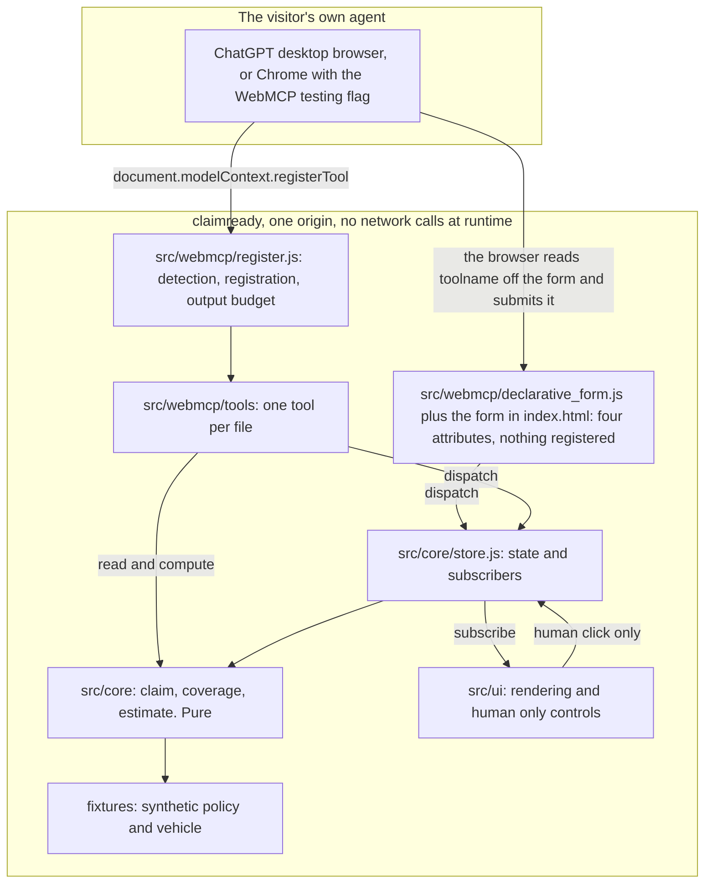

# ClaimReady architecture

ClaimReady is a static page with no dependencies, no bundler and no build step. Every file the
browser loads is a file in this repo, served as written. That is a deliberate choice, not a
shortcut: a judge can read the whole tool surface without running anything, and the deployed bytes
are the reviewed bytes.

## The layer map



Arrows point the way imports and calls go. Nothing points back up. `src/core` sits at the bottom
and knows nothing about anything above it.

## The dependency rule

**`src/core` imports nothing from the browser.** No `document`, no `window`, no `navigator`, no
`fetch`, no timers, no storage. It is plain functions over plain objects.

Three things follow, and they are the reason the rule exists.

1. The domain runs under `node --test` with no harness, no DOM shim and no mocking library. A test
   is an import and an assertion.
2. The coverage decision and the repair band can be reasoned about on their own. When the page says
   a claim is not covered, the sentence comes from a table lookup that a judge can read in one file.
3. The tool layer becomes thin. A tool validates its input, calls a pure function, and formats the
   answer. There is no business logic hiding inside a tool handler where nothing can reach it.

The rule is machine checked. `node scripts/readiness.mjs` strips comments from every module in
`src/core`, matches on browser identifiers, and fails the `PUR` row if it finds one. It is a
structural assertion, so the next module that reaches for `window` fails at authoring time rather
than in review.

## The layers, and why each one exists

### `src/core`, the domain

Pure, browser free, unit tested. **Nine modules**, from `ls src/core/*.js`: canonical, claim,
coverage, estimate, filing, packet, policy, requirements and store. The block below draws the
four the rest of the build imports directly and is not the whole directory. This line said "Four
modules" until 2026-09-03, when the count and the drawing were the same number by accident and
stopped being when `canonical.js` was split out of `packet.js`.

```
store.js     createStore(initialState) -> { getState, dispatch, subscribe }
             actions: { type:'patch', field, value } | { type:'reset' } | { type:'file' }
             subscribe returns an unsubscribe function, dispatch notifies synchronously

claim.js     INCIDENT_TYPES, SEVERITIES, DAMAGE_ZONES, REQUIRED_FIELDS
             createClaim(fixture) -> claim
             applyPatch(claim, field, value) -> { claim, ok, error }   pure, returns a NEW claim
             validateClaim(claim) -> { ready, missing, warnings }
             describeClaim(claim) -> string, under 1200 characters

coverage.js  checkCoverage(policy, claim) -> { covered, clause, deductible, currency, reason, exclusions }
             deterministic table lookup, able to return covered:false with a clause id

estimate.js  estimateRepair({ zone, severity, vehicleClass }) -> { low, high, currency, lines }
             deterministic band from a parts table
```

`applyPatch` returning a new claim rather than mutating is what makes the agent path and the human
path the same path. Both go through the store, both notify subscribers, and neither can leave the
claim in a state the other cannot see.

`estimateRepair` returns a band, and the word for it is a triage band. It is a lookup, so it is not
a prediction and the interface never calls it one.

### `src/webmcp/register.js`, detection and registration

One module, and the only place in the codebase that knows the browser API exists.

```
getModelContext()            document.modelContext, then navigator.modelContext, else null
getApiName()                 which spelling this browser exposes, for the status strip
registerTools(ctx, tools)    -> { available, api, registered, skipped, failed }
unregisterTool(name)         aborts that tool's signal and withdraws it
registeredToolNames()        what this page believes is registered
onToolChange(handler)        subscribe to the browser's toolchange event
toResult(text)               wrap as an MCP content array and clamp to the output budget
textOfResult(result)         pull the text back out, for the on page ledger
startToolSurface(ctx, opts)  the page's ONLY entry point: registers the always on tools, keeps
                             the conditional ones matching the claim, and reports every change
```

`startToolSurface` is the single integration point. The page does not know which tools exist and
holds no list of them: `ALWAYS_ON_TOOLS` and `CONDITIONAL_TOOLS` live here, the store subscription
lives here, and the page only supplies a context and receives a description of what moved.

Registration holds one `AbortController` per tool name, because not every tool exists at page
load. Roadside assistance options become a tool the moment the claim says the vehicle cannot be
driven, and the tool is withdrawn again when that stops being true. Nobody has to press anything
for it to appear, and pressing the assistance button does not change the tool set. That is
`registerTool(definition, { signal })` plus the `toolchange` event, and it is why registration is a
layer rather than a loop at the bottom of a file.

`registerTools` never throws when the API is absent. A browser with no agent falls through to an
ordinary page that a person can fill in by hand.

### `src/webmcp/tools`, one tool per file

Each file default exports one factory and nothing else.

```js
import { toResult } from '../register.js';

export default (ctx) => ({
  name: 'check_coverage',
  description: 'What this returns. Descriptive only, at most 500 characters, no instructions.',
  inputSchema: { type: 'object', properties: {}, additionalProperties: false },
  annotations: { readOnlyHint: true },
  async execute(input, options) {
    if (options?.signal?.aborted) return toResult('Cancelled.');
    return toResult('...');
  },
});
```

Rules the readiness gate enforces on every file in this directory:

- exactly one `name:` string literal, lower snake case, at most 30 characters
- `annotations` present, and `readOnlyHint` declared explicitly rather than left to a default
- `inputSchema` present, and `execute` present
- no `exposedTo`, ever. Tools stay same origin
- the name is not one of the human only actions listed below

One tool per file is not tidiness. It is what makes the budget rule and the parameter description
rule computable without parsing JavaScript, and it means a reviewer counting the registered tools
counts files. It does not count the whole published surface any more: the declarative form below is
one more thing an agent can call and it is not a file in this directory, which is why the page
reports the two halves as two numbers rather than one.

### `src/webmcp/declarative_form.js`, the other half of the API

Everything above is the imperative API, one JavaScript descriptor per tool. WebMCP has a second
half: four HTML attributes on a form. `index.html` carries one form with `toolname`,
`tooldescription`, `toolautosubmit` and a `toolparamdescription` on each control, and the browser
builds the input schema from the form itself, so no module here writes one.

That is the migration path stated as code rather than as a paragraph. An insurer already serving an
intake form adopts WebMCP on it by adding attributes to markup they already ship, instead of
rewriting the page as tool descriptors.

```
declarative_form.js   FORM_TOOL_NAME, FORM_TOOL_DESCRIPTION, FORM_CONTROLS
                      describeDeclarativeForm() -> one surface entry, declarative: true
                      planSubmission(input)     -> { changes, actor, baseRevision, empty, fields }
                      describeOutcome(outcome)  -> the sentence handed back, refusals included
```

It is pure, like `src/core`, and it holds no rule of its own. The submit handler in `src/ui/app.js`
dispatches through the same store as every other control, so `src/core/claim.js` decides the result
and the refusals are identical on both paths. The one thing the form reads off the event to tell a
person from an agent is `agentInvoked`, and a refusal is put back through `respondWith` in the words
`src/core` used, clipped to the same output budget every tool answer is clipped to.

Three consequences worth naming, because they are the ones a reviewer should check:

1. **No annotation is claimed for it.** `readOnlyHint` and `untrustedContentHint` belong to a
   registered descriptor. A form carries neither, so the page's own list marks the row declared
   rather than registered and says what the form does instead of what it declares.
2. **The revision protocol still holds.** A third control carries the revision an agent read.
   Empty means no revision was quoted, which `src/core/claim.js` refuses with the message that names
   the number to send, rather than an empty string that would coerce to a stale quote of revision 0.
3. **It degrades to an ordinary form.** A browser with no declarative API sees four unknown
   attributes, which the parser keeps and ignores. A person fills the boxes and presses the button
   and nothing about the page depends on an agent being there.

What has not been verified is in the README, in the table under `The declarative half`: the form has
been driven by hand and the agent branch has been driven by a constructed `SubmitEvent`, and no
browser has yet been watched synthesising a tool from the attributes.

### `src/ui`, rendering and the human only controls

Subscribes to the store, renders on change, and owns the controls that are not tools: filing,
requesting assistance, and the per field pin. It is the only layer allowed to touch the DOM, and it
holds the tool call ledger that shows a visitor exactly what their agent just did.

## What is deliberately not a tool

Filing the claim, requesting roadside assistance, and pinning or unpinning a field are human only.
They are never registered, so there is nothing for a prompt injected agent to call.

Say what that does and does not mean. It does not mean the button is unreachable. An agent driving
a browser clicks ordinary DOM buttons, the W3C security considerations say so, and no check on this
page could separate that click from a person's: an `isTrusted` test blocks an honest probe and
passes a remotely driven browser, so we do not ship one. What it does mean is that an agent working
through the published tool surface finds no name to call for any of the three, while it can still
write a wrong value into any field the claimant has not pinned.

The readiness gate treats the tool surface half as a testable claim rather than a promise. The
`HUM` row scans every file in `src/webmcp/tools` for a tool named `file_claim`, `submit_claim`,
`submit`, `file`, `request_assistance`, `request_roadside`, `dispatch_services`, `dispatch`,
`override_eligibility`, `override`, `pin_field`, `unpin_field`, `lock_field` or `unlock_field`, and
fails if one appears. That is a name blocklist run over the tool files on every push. It proves no
tool file declares one of those names. It is not a runtime guard on the buttons, and nothing here
is.

It is also narrower than the published surface since the declarative form landed. The row reads
`src/webmcp/tools` only, so a human only name arriving as a `toolname` attribute in `index.html`
would not be caught by it. `grep -n 'toolname=' index.html` lists every declared tool on the page, and
there is one, `record_supporting_details`, which writes two optional claim fields.

## Constraints that reach across all three layers

**The Content Security Policy forbids inline code.** The policy that actually holds in production
is the `<meta http-equiv="Content-Security-Policy">` tag in `index.html`, because production is
GitHub Pages and GitHub Pages sends no CSP header of its own. It carries
`script-src 'self'; style-src 'self'`, with no `unsafe-inline`. So there is no `<style>` block and
no inline `<script>` in `index.html`. Styles live in a CSS file, behaviour lives in modules loaded
with `<script type="module" src="...">`. The readiness `IDX` row fails the build if an inline block
appears, because that failure would otherwise show up only as a blank page on the deployed origin
and not on a local file server.

`vercel.json` carries the same directives as response headers, plus `frame-ancestors`, which a meta
tag cannot express. Nothing in production reads that file. It is the config a header capable host
would need, it is checked by the readiness `VRC` row as such, and it is not evidence about the live
origin. The meta tag is.

**The flagship sentence ships in the page.** `index.html` contains the sentence verbatim. The live
check fetches the judge URL and requires HTTP 200 and that sentence in the body, which is how the
gate knows the origin is serving this build rather than an older deploy.

**Both API names are feature detected.** `document.modelContext` is the current name and
`navigator.modelContext` is the older one that some builds still ship. Detecting only one means the
page silently registers nothing in one of the two judge paths.

**Budgets from the Chrome tool security guide.** Tool name at most 30 characters, tool description
at most 500, each parameter description at most 150, tool output at most 1500. The first three are
static text and are enforced by `scripts/check_style.mjs`, which sums concatenated string literals
so that a description split across four source lines is measured as the one string the agent
actually receives. The output budget is computed at run time, so it is structural instead: every
tool returns through `toResult`, which clamps the text, and no tool builds a result any other way.

**Execute returns the MCP content array shape**, `{ content: [{ type: 'text', text }] }`. Chrome's
own examples return a plain string and both are accepted, so this is a house style choice for one
consistent shape across the tool surface. It is also the first thing to swap if a tool call ever
comes back empty in a real judge path, and because every tool returns through `toResult`, that
swap is one line in one file rather than an edit in every tool.

**Annotations are declared, not defaulted.** The read tools carry `readOnlyHint: true`. The one
tool that writes carries `readOnlyHint: false`, stated rather than omitted, because an empty
annotations block leaves an agent unable to tell a write apart from a tool nobody got round to
annotating. The readiness gate fails a tool file that does not say which it is.

## Testing

`node --test tests/unit` runs the domain. No install, no runner, no config file. Tests import from
`src/core` directly.

The rule that matters for fixtures: a test that builds its input from the same constant the code
reads cannot fail. Coverage tests state their expected clause id as a literal, and at least one
coverage case starts from a policy that does not hold the rider, so the table is exercised in both
directions rather than only on the happy path.

## The gates

Three gates, all dependency free, all runnable offline, and they live in three different workflows.
`check_style.mjs` and the unit suite run in **CI**. `readiness.mjs` runs in **Readiness**, which is
a separate workflow since 2026-08-28 precisely so that a missing deliverable stops turning the
engineering badge red. `evals/replay.mjs` runs in **WebMCP evals**, ahead of anything that installs.

A fourth script under `scripts/` is not a gate and is not in any workflow.
`scripts/measure_intake.mjs` counts fields: how many distinct questions a static form would have to
ask everyone, taken as the union over both rule packs in `fixtures/insurers/` and the required list
in `src/core/claim.js`, against how many this page's derived intake asks for a given pack and
incident type. It prints every combination, the rule that drops each question with the condition
quoted from the pack JSON, and the command that produced the output. It measures this repository's
own invented packs and extrapolates nothing beyond them.

`scripts/check_style.mjs` reads every tracked text file and fails on em dash code points, on
annotation names that WebMCP does not define, on the names of other projects, and on tool metadata
over budget. It counts dashes by code point rather than by a shell grep so that an encoding cannot
hide one.

`scripts/readiness.mjs` prints one table. Every row declares what it blocks. Engineering rows are
the build's own work and the **Readiness** workflow turns red on them. It used to be CI, and that
was the problem: one missing video made the engineering badge read red on every branch, which told
a reader the build was broken when nothing about the build was. Deliverable rows are the things a judge needs to
exist, and they turn the build red too, in every mode, because a missing mandatory deliverable that
leaves a green exit is the failure this whole project is most likely to repeat. Owner gated rows
print in their own block with the manual step, because a script cannot prove any of them.

Two tallies are printed, and the reason there are two is that one number would be read as the wrong
answer. The first counts only the rows a script proved. The second adds the owner gated rows, and
it is the one that answers "is this ready to submit", because pressing Submit is on that list and
no script can press it. Neither number moves when the exit code's scope changes. `--ci` narrows
what turns the build red, not what is measured or printed.

`node scripts/readiness.mjs --selftest` breaks every row the table prints, one at a time, in its own
sandbox, and requires each one to report FAIL. It prints the detail line each broken check produced,
so a row that failed for the wrong reason is visible rather than merely red. A row that cannot be
broken would be printed with the reason instead of quietly skipped, and today there are none. A gate
nobody has watched fail is not evidence of anything.

`node evals/replay.mjs` replays the eval journeys and the negative control against the real WebMCP
registration path with a stand in for `document.modelContext`. It is held to the same rule. Three
mutations break it on purpose, one refusing a patch that should land, one keeping a tool after its
AbortSignal fires, one refusing to register the conditional tool at all, and the workflow fails if
any of the three survives. `evals/README.md` has the measured output of all four runs.
