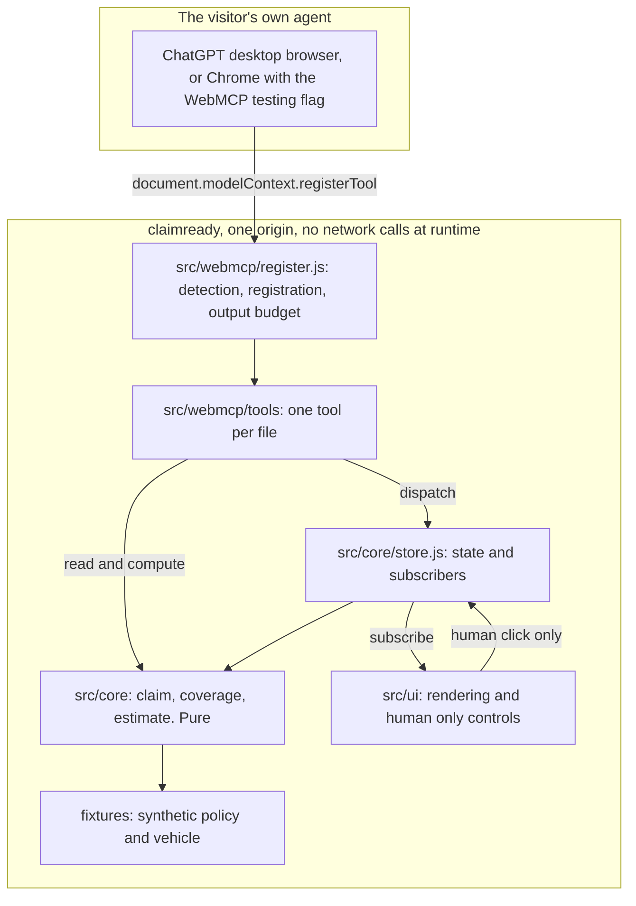

# ClaimReady architecture

ClaimReady is a static page with no dependencies, no bundler and no build step. Every file the
browser loads is a file in this repo, served as written. That is a deliberate choice, not a
shortcut: a judge can read the whole tool surface without running anything, and the deployed bytes
are the reviewed bytes.

## The layer map



Arrows point the way imports and calls go. Nothing points back up. `src/core` sits at the bottom
and knows nothing about anything above it.

## The dependency rule

**`src/core` imports nothing from the browser.** No `document`, no `window`, no `navigator`, no
`fetch`, no timers, no storage. It is plain functions over plain objects.

Three things follow, and they are the reason the rule exists.

1. The domain runs under `node --test` with no harness, no DOM shim and no mocking library. A test
   is an import and an assertion.
2. The coverage decision and the repair band can be reasoned about on their own. When the page says
   a claim is not covered, the sentence comes from a table lookup that a judge can read in one file.
3. The tool layer becomes thin. A tool validates its input, calls a pure function, and formats the
   answer. There is no business logic hiding inside a tool handler where nothing can reach it.

The rule is machine checked. `node scripts/readiness.mjs` strips comments from every module in
`src/core`, matches on browser identifiers, and fails the `PUR` row if it finds one. It is a
structural assertion, so the next module that reaches for `window` fails at authoring time rather
than in review.

## The layers, and why each one exists

### `src/core`, the domain

Pure, browser free, unit tested. Four modules with fixed signatures.

```
store.js     createStore(initialState) -> { getState, dispatch, subscribe }
             actions: { type:'patch', field, value } | { type:'reset' } | { type:'file' }
             subscribe returns an unsubscribe function, dispatch notifies synchronously

claim.js     INCIDENT_TYPES, SEVERITIES, DAMAGE_ZONES, REQUIRED_FIELDS
             createClaim(fixture) -> claim
             applyPatch(claim, field, value) -> { claim, ok, error }   pure, returns a NEW claim
             validateClaim(claim) -> { ready, missing, warnings }
             describeClaim(claim) -> string, under 1200 characters

coverage.js  checkCoverage(policy, claim) -> { covered, clause, deductible, currency, reason, exclusions }
             deterministic table lookup, able to return covered:false with a clause id

estimate.js  estimateRepair({ zone, severity, vehicleClass }) -> { low, high, currency, lines }
             deterministic band from a parts table
```

`applyPatch` returning a new claim rather than mutating is what makes the agent path and the human
path the same path. Both go through the store, both notify subscribers, and neither can leave the
claim in a state the other cannot see.

`estimateRepair` returns a band, and the word for it is a triage band. It is a lookup, so it is not
a prediction and the interface never calls it one.

### `src/webmcp/register.js`, detection and registration

One module, and the only place in the codebase that knows the browser API exists.

```
getModelContext()            document.modelContext, then navigator.modelContext, else null
getApiName()                 which spelling this browser exposes, for the status strip
registerTools(ctx, tools)    -> { available, api, registered, skipped, failed }
unregisterTool(name)         aborts that tool's signal and withdraws it
registeredToolNames()        what this page believes is registered
onToolChange(handler)        subscribe to the browser's toolchange event
toResult(text)               wrap as an MCP content array and clamp to the output budget
textOfResult(result)         pull the text back out, for the on page ledger
```

Registration holds one `AbortController` per tool name, because not every tool exists at page
load. Roadside assistance status only becomes a tool after a person has actually requested
assistance, and it disappears again when the request is closed. That is
`registerTool(definition, { signal })` plus the `toolchange` event, and it is why registration is a
layer rather than a loop at the bottom of a file.

`registerTools` never throws when the API is absent. A browser with no agent falls through to an
ordinary page that a person can fill in by hand.

### `src/webmcp/tools`, one tool per file

Each file default exports one factory and nothing else.

```js
import { toResult } from '../register.js';

export default (ctx) => ({
  name: 'check_coverage',
  description: 'What this returns. Descriptive only, at most 500 characters, no instructions.',
  inputSchema: { type: 'object', properties: {}, additionalProperties: false },
  annotations: { readOnlyHint: true },
  async execute(input, options) {
    if (options?.signal?.aborted) return toResult('Cancelled.');
    return toResult('...');
  },
});
```

Rules the readiness gate enforces on every file in this directory:

- exactly one `name:` string literal, lower snake case, at most 30 characters
- `annotations` present, and `readOnlyHint` declared explicitly rather than left to a default
- `inputSchema` present, and `execute` present
- no `exposedTo`, ever. Tools stay same origin
- the name is not one of the human only actions listed below

One tool per file is not tidiness. It is what makes the budget rule and the parameter description
rule computable without parsing JavaScript, and it means a reviewer counting the tool surface counts
files.

### `src/ui`, rendering and the human only controls

Subscribes to the store, renders on change, and owns the two buttons that are not tools. It is the
only layer allowed to touch the DOM, and it holds the tool call ledger that shows a visitor exactly
what their agent just did.

## What is deliberately not a tool

Filing the claim and requesting roadside assistance are human only. They are never registered, so
there is nothing for a prompt injected agent to call. A model that has been talked into filing a
fraudulent claim still has to persuade a person to press a button.

The readiness gate treats this as a testable claim rather than a promise. The `HUM` row scans every
file in `src/webmcp/tools` for a tool named `file_claim`, `submit_claim`, `submit`, `file`,
`request_assistance`, `request_roadside`, `dispatch_services`, `dispatch`, `override_eligibility` or
`override`, and fails if one appears. The security boundary is checked on every push.

## Constraints that reach across all three layers

**The Content Security Policy forbids inline code.** `vercel.json` ships
`script-src 'self'; style-src 'self'`, with no `unsafe-inline`. So there is no `<style>` block and
no inline `<script>` in `index.html`. Styles live in a CSS file, behaviour lives in modules loaded
with `<script type="module" src="...">`. The readiness `IDX` row fails the build if an inline block
appears, because that failure would otherwise show up only as a blank page on the deployed origin
and not on a local file server.

**The flagship sentence ships in the page.** `index.html` contains the sentence verbatim. The live
check fetches the judge URL and requires HTTP 200 and that sentence in the body, which is how the
gate knows the origin is serving this build rather than an older deploy.

**Both API names are feature detected.** `document.modelContext` is the current name and
`navigator.modelContext` is the older one that some builds still ship. Detecting only one means the
page silently registers nothing in one of the two judge paths.

**Budgets from the Chrome tool security guide.** Tool name at most 30 characters, tool description
at most 500, each parameter description at most 150, tool output at most 1500. The first three are
static text and are enforced by `scripts/check_style.mjs`, which sums concatenated string literals
so that a description split across four source lines is measured as the one string the agent
actually receives. The output budget is computed at run time, so it is structural instead: every
tool returns through `toResult`, which clamps the text, and no tool builds a result any other way.

**Execute returns the MCP content array shape**, `{ content: [{ type: 'text', text }] }`. Chrome's
own examples return a plain string and both are accepted, so this is a house style choice for one
consistent shape across the tool surface. It is also the first thing to swap if a tool call ever
comes back empty in a real judge path, and because every tool returns through `toResult`, that
swap is one line in one file rather than an edit in every tool.

**Annotations are declared, not defaulted.** The read tools carry `readOnlyHint: true`. The one
tool that writes carries `readOnlyHint: false`, stated rather than omitted, because an empty
annotations block leaves an agent unable to tell a write apart from a tool nobody got round to
annotating. The readiness gate fails a tool file that does not say which it is.

## Testing

`node --test tests/unit` runs the domain. No install, no runner, no config file. Tests import from
`src/core` directly.

The rule that matters for fixtures: a test that builds its input from the same constant the code
reads cannot fail. Coverage tests state their expected clause id as a literal, and at least one
coverage case starts from a policy that does not hold the rider, so the table is exercised in both
directions rather than only on the happy path.

## The gates

Two scripts, both dependency free, both runnable offline.

`scripts/check_style.mjs` reads every tracked text file and fails on em dash code points, on
annotation names that WebMCP does not define, on the names of other projects, and on tool metadata
over budget. It counts dashes by code point rather than by a shell grep so that an encoding cannot
hide one.

`scripts/readiness.mjs` prints one table. Every row declares what it blocks. Engineering rows are
the build's own work and CI turns red on them. Submission rows are the four things a judge needs to
exist, and they stay visible and outstanding until they are real. Owner gated rows print in their
own block with the manual step and are never counted as passes, because a person has to do them and
counting them would let the score drift away from the truth.

There is one score over all counted rows, and it does not move when the exit code's scope changes.
`--ci` narrows what turns the build red, not what is measured or printed.

`node scripts/readiness.mjs --selftest` breaks three inputs on purpose, a README without the
flagship sentence, a file holding an em dash, and an unreachable host, and requires all three to
report FAIL. A gate nobody has watched fail is not evidence of anything.
